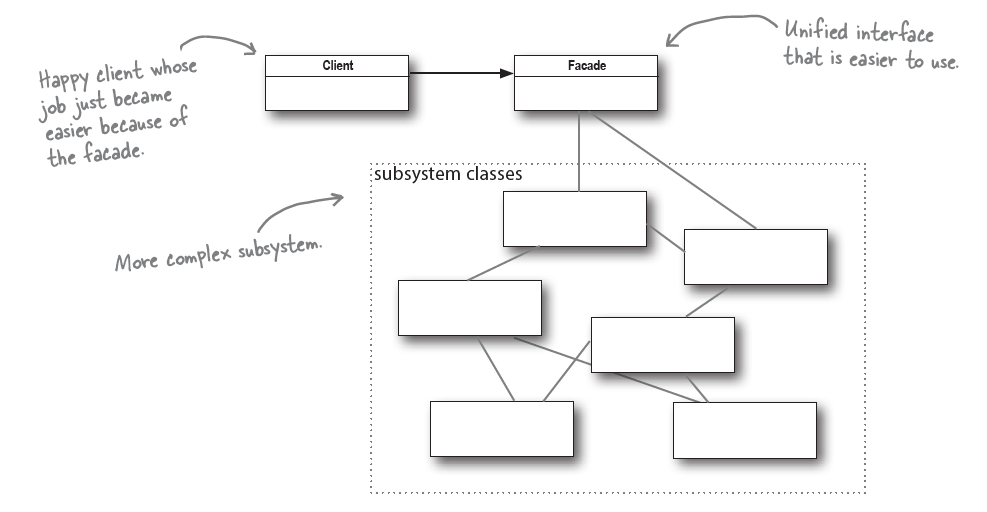

# Understanding the Facade Design Pattern: Simplifying Complex Systems


## Introduction

The Facade Design Pattern is one of the most widely used <strong> structural design patterns </strong> in software engineering. It provides a simplified interface to a complex subsystem of classes, library, or framework. Just as a building's facade presents a unified, elegant exterior that hides the complex internal structure, this pattern offers a clean, easy-to-use interface that masks the intricacies of the underlying system.

## The Need for Facade Pattern

Modern software systems often grow increasingly complex, with numerous interconnected components and subsystems. This complexity can lead to several challenges:

1. Developers need to understand multiple subsystems to perform simple operations
2. Direct interaction with subsystems creates tight coupling
3. Client code becomes cluttered with subsystem-specific details
4. System maintenance and modifications become difficult
5. Code reusability is reduced due to tight integration

## What is the Facade Pattern?

The Facade pattern provides a unified interface to a set of interfaces in a subsystem. It defines a higher-level interface that makes the subsystem easier to use.

## Problems Solved by Facade Pattern

The Facade pattern addresses several key issues in software design:

1. Subsystem Complexity: It shields clients from complex subsystem components, reducing the learning curve for new developers.

2. System Decoupling: It promotes loose coupling between clients and subsystems, making the system more maintainable.

3. Layer Definition: It helps in defining clear layers in the application architecture, improving system organization.

4. Legacy System Integration: It provides a modern interface to legacy code, making it easier to work with older systems.

## Industrial Applications

The Facade pattern finds extensive use in various industrial scenarios:

1. Enterprise Applications: Simplifying complex business logic and workflows

2. Framework Integration: Providing simplified APIs for complex frameworks like Spring or Hibernate

3. Legacy System Modernization: Creating modern interfaces for legacy systems

4. Mobile Development: Abstracting complex backend services into simple mobile APIs

5. Microservices: Providing unified interfaces to multiple microservices

## Pros and Cons

### Advantages

1. Simplified Interface: Provides a simple interface to complex systems

2. Decoupling: Reduces dependencies between client code and subsystems

3. Layer Isolation: Helps in implementing the principle of separation of concerns

4. Enhanced Maintainability: Makes systems easier to modify and maintain

5. Improved Readability: Results in cleaner, more understandable client code

### Disadvantages

1. Additional Layer: Introduces another layer that needs to be maintained

2. Potential Bottleneck: The facade can become a bottleneck if not designed properly

3. Over-Simplification: May hide necessary complexity that clients should be aware of

4. Limited Flexibility: Clients might need access to subsystem features not exposed by the facade

## The Principle of Least Knowledge (Law of Demeter)

The Principle of Least Knowledge, also known as the Law of Demeter (LoD), is a design guideline that states that a unit should have limited knowledge about other units and should only talk to its immediate friends. In essence, it suggests that an object should avoid calling methods on objects that are returned by other method calls.
The principle can be summarized as: only talk to your immediate neighbors, or "don't talk to strangers."
Here's an example to illustrate:

```java
// Violating Law of Demeter
class Customer {
    private Wallet wallet;
    
    public void payForOrder(Order order) {
        // Reaching through wallet to get money - violates LoD
        Money money = wallet.getMoney();
        order.processPayment(money);
    }
}

// Following Law of Demeter
class Customer {
    private Wallet wallet;
    
    public void payForOrder(Order order) {
        // Wallet handles the money interaction internally
        wallet.payAmount(order.getAmount());
        order.markAsPaid();
    }
}
```

In such cases, the
principle forces us to ask the object to make the request for us;
that way, we don’t have to know about its component objects
(and we keep our circle of friends small). For example:


## Why The Principle of Least Knowledge Matters in Facade Pattern

The Principle of Least Knowledge is particularly relevant to the Facade pattern for several reasons:

1. **Alignment of Goals**: Both LoD and Facade pattern aim to reduce coupling and hide complexity from clients.

2. **Encapsulation Enhancement**: The Facade pattern naturally supports LoD by encapsulating complex subsystem interactions within the facade interface.

3. **Interface Simplification**: LoD guides the design of facade interfaces, helping determine what should be exposed to clients.

Example of applying LoD in Facade:

```java
// Without considering LoD
class OrderFacade {
    private InventorySystem inventory;
    private PaymentSystem payment;
    
    public Order processOrder(Customer customer) {
        // Violating LoD by exposing subsystem objects
        PaymentDetails details = payment.getPaymentSystem().getDetails();
        InventoryItem item = inventory.getDatabase().findItem();
        return new Order(details, item);
    }
}

// Following LoD
class OrderFacade {
    private InventorySystem inventory;
    private PaymentSystem payment;
    
    public Order processOrder(Customer customer) {
        // Encapsulating subsystem interactions
        boolean paymentValid = payment.validatePayment(customer);
        boolean itemAvailable = inventory.checkAvailability();
        
        if (paymentValid && itemAvailable) {
            return createOrder(customer);
        }
        throw new OrderException("Unable to process order");
    }
}
```

## Should We Apply LoD When Working with Facade Pattern?

The short answer is yes, but with careful consideration. Here's why:

1. **Enhanced Encapsulation**: Following LoD strengthens the facade's role as a simplifying interface.

2. **Maintainability**: Makes it easier to modify subsystem implementations without affecting clients.

3. **Cleaner APIs**: Results in more intuitive and focused interfaces.

4. **Reduced Coupling**: Further decreases dependencies between clients and subsystems.

## Disadvantages of Applying the Principle of Least Knowledge

While beneficial, applying LoD strictly can have some drawbacks:

1. **Performance Overhead**:
    - Additional wrapper methods might impact performance
    - Extra method calls can increase processing time

2. **Increased Code Volume**:
    - More delegation methods need to be written
    - Can lead to "middleware bloat"

3. **Potential Over-Abstraction**:
    - Might hide necessary complexity
    - Can make debugging more difficult

4. **Development Time**:
    - Writing wrapper methods takes additional time
    - Increases initial development effort

5. **Complexity Trade-off**:
    - While reducing coupling, might increase the complexity of the facade itself
    - Can make the facade harder to maintain

Example of trade-offs:

```java
// Without LoD - simpler but more coupled
class OrderFacade {
    public PaymentSystem getPaymentSystem() {
        return paymentSystem;
    }
}

// With LoD - more methods but better encapsulation
class OrderFacade {
    public boolean processPayment(double amount) { }
    public boolean validatePayment() { }
    public void cancelPayment() { }
    public PaymentStatus getPaymentStatus() { }
    // Many more wrapper methods needed
}
```

## Finding the Right Balance

When implementing a Facade pattern, consider these guidelines for applying LoD:

1. Apply LoD when:
    - The subsystem implementation is likely to change
    - Client code needs to be protected from subsystem complexity
    - Clear boundaries between system layers are crucial

2. Relax LoD when:
    - Performance is critical
    - The subsystem interface is stable
    - Clients need more direct control for specific use cases

## Conclusion

The Facade Design Pattern is a powerful tool in software design that helps manage complexity and improve system organization. While it's not a silver bullet for all design challenges, it provides significant benefits when used appropriately. Its ability to simplify complex systems while promoting loose coupling makes it an invaluable pattern in modern software development.

The key to successfully implementing the Facade pattern lies in finding the right balance between simplification and functionality. When used judiciously, it can significantly improve code maintainability, readability, and overall system architecture. As software systems continue to grow in complexity, the importance of patterns like Facade that help manage this complexity becomes increasingly evident.

Remember that like any design pattern, Facade should be applied thoughtfully, considering the specific needs and constraints of your system rather than as a one-size-fits-all solution.